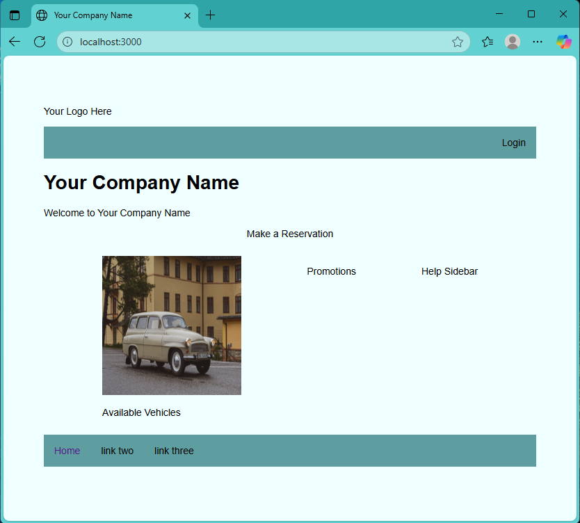
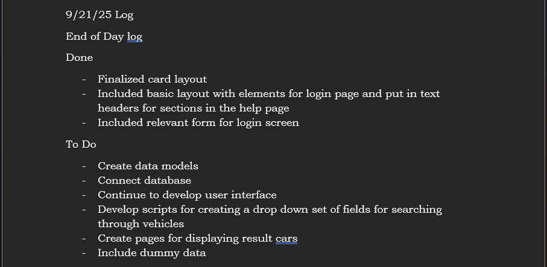
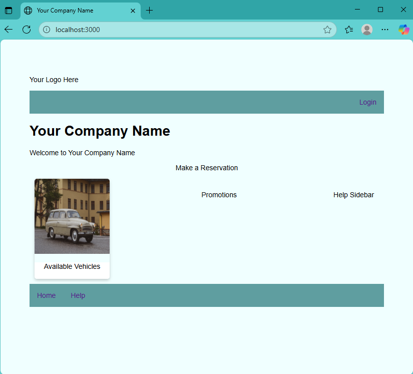

# Krystal Grant

## Professional Self Assessment

\[ Section to be written and included \]

## Link to Final Artifact Repository

See the artifact in question **[here](https://github.com/Krystal-G116/CS_499_Tracker/tree/final)**

## Enhancement Category 1: Software Design and Engineering

The initial artifact for this submission was a package of files used in developing test cases for CS 320. This package was the final submission for that class and was completed in December of 2024. I chose to include this artifact in my portfolio because I felt that it was the most fleshed out piece of work that I had from a previous course that I could build upon. This artifact proved to be a basis for me in developing a final enhancement plan based on these initial classes and the structure of the information and methods. This resulted in the decision to create a full stack application for all three categories based loosely on these initial classes. The initial artifact has yet to be improved as I realized during development for this stage that much of the class structure resembles the data model and intended schema for the information that will be help in the database. Since the intention is for the application to be a full stack application, a front end and framework had to be developed which was the focus of this first enhancement. By creating this front facing user interface and creating a full stack framework, I have made it easier to further improve on the artifact by translating the classes and methods to data models and routing methods that can later be used with a database to translate these classes into a practical application.
  
I did not fully meet the intended enhancement goals that I had set for this enhancement of translating the original classes into JavaScript as the resemblance to a data model made it more fitting for the second category enhancement. Instead, the focus became designing and developing a basic user side with elements to accept user input and further process queries or requests. Not all of this functionality was completed, in particular the design of the dropdown menu for the search component, but the ability to rapidly develop the artifact to this point was a large accomplishment. 

The amount of design left to do with the UI elements themselves led me to leave more complex designs for later development and so my intention is to continuously update the interface as I continue developing the artifact for the remaining two categories. 

Looking at the course outcomes, I showed my ability to design visual communications through data flow diagrams and ER diagrams, such as the one below and also demonstrated a learning mindset and concerns for best practices by researching industry technologies and standards for testing and authentication in a full stack, and noting any results of my research in my informal tracker.

Security was also at the forefront of my concerns in planning for proper authentication set up before connecting the database or publishing the site to prevent malicious attacks or breaches.
  
I faced a lot of challenges in deciding which parts of the stack to focus and work on during the development of this first enhancement, but making a tracking file for myself to monitor my progress and tasks left to do helped keep me focused and allowed me to analyze and restructure my later development plans.

Another challenge came in finding and using recommended technologies as some of them I have not been exposed to fully and so created a bit of a learning curve, however I was able to use references from the internet and previous coursework to adapt to this obstacle. 

## Enhancement Category 2: Algorithms and Data Structure

This category saw a continued development of the full stack application from the first category enhancement. I chose to continue developing this artifact to demonstrate my ability to integrate multiple computer science competencies within a single project. This enhancement added a [model schema](https://github.com/Krystal-G116/CS_499_Tracker/blob/final/app_api/models/vehicles.js) for defining a Mongoose schema to be used with MongoDB in the application stack. Controllers and views were then used to include the test data set and display them in the view using vairables in the template. The seed file is found in `/models/seed.js` and takes a trimmed version of the original dataset `used_car_data_trimmed.csv` and extracts relevant elements to create an instance of the Vehicle model.

Data provided by user [Ananaymital](https://www.kaggle.com/datasets/ananaymital/us-used-cars-dataset?resource=download) on kaggle.

A short script was created to aid in the further development of the front end of the application by creating dynamic responses to components on the home page.

My enhancement for this milestone demonstrated my ability to come up with solutions for simple problems using algorithms and templating. I plan to develop this further as I include database elements and queries. My use of other dependencies showed my ability to work with different syntax and components to create a single project. My design of the vehicle schema demonstrated an understanding for data structure, as well as identification of where additional data may need to be stored. Using a subset of test data before database integration also showed an understanding for conserving resources and establishing functionality with test data prior to database integration. My focus throughout the enhancements has also been to continuously deliver increasing functionality with each day of work and through this process I am also demonstrating my ability to work within a continuous development project effectively. While I still intend to have authentication, authorization, and elements of RBAC within the system for security, I was waiting for integration with the database to also test saving and securing user data. I can improve on the current enhancement to further reach this outcome by ensuring data entered at point of input are validated and protected from XSS.

As I was improving the artifact, I began to have more of an appreciation for the continuous development environment and Agile approaches to development. While I am neglecting to use many of the standard forms of planning and input from an outside client, I do believe that I am maintaining the mindset of continuous user side functionality and flexibility in design and development, especially with a small single person project. Struggles I have faced in considering design elements during the enhancement were times when I referenced some real sites, for examples on current feel for designs related to the type of application I am prototyping. I do still struggle with continuous documentation of the artifact as I continue development but I am hoping to get critical elements referenced and commented before polishing.

## Enhancement Category 3: Databases

The artifact being developed for this milestone is a continuation of the artifact developed in the previous milestones. The overall artifact is an example of a full-stack application for a possible vehicle rental service. I chose to continue this artifact’s development as and include it in my ePortfolio because the prototype application incorporates aspects of software design, data structures and algorithms, databases and security.

The design of the user interface, stack and application structure, and development process demonstrate my skills in design. While my more Agile approach to development of this application also showcases my ability to work in fast paced environments, my ability to balance development with other life factors has shown how quickly I can be derailed. The data structures developed to describe the vehicles in the rental application and the algorithms used to extract and display data to the user demonstrate aspects of problem solving that I am capable of and ability to reuse solutions within the application. These enhancements also lend themselves well to connecting with a database which was the focus of the improvement for this milestone. For this milestone I took the sample data that I had trimmed and used it to seed a database for the vehicles. From here I created an API to handle data communication between the database and the main application and verified this in the console and by accessing data in from the main application. I used this data to then improve upon another client view to display a listing of available vehicles. These were the initial improvements but with the foundation in place, including other data structures and routes should be simple.

During my Module one plan I had hoped to meet the outcomes related to database solutions and developing with security in mind, however I have not implemented the authentication or RBAC to API methods to access the database. I still intend on including these improvements prior to the final submission but am concerned that I may not be able to develop the application as completely as I want to. As I was improving the artifact it allowed me to consider more the use of a potential single page application for certain views within the application compared with the amount of data that could end up in a production level application of this scope. The main challenge that I have been faced with is completion of other coursework alongside this development and my job. Finding a balance between the three has slowed development to a near halt.

\[ Include image references of relevant enhancements \]

## Code Review
Review of Artifact Before Enhancements: [Artifact Code Review](https://drive.google.com/file/d/1Crhp4tPFOR4MWdPbzHPqI5ZC3CrHGAqW/view?usp=sharing)
